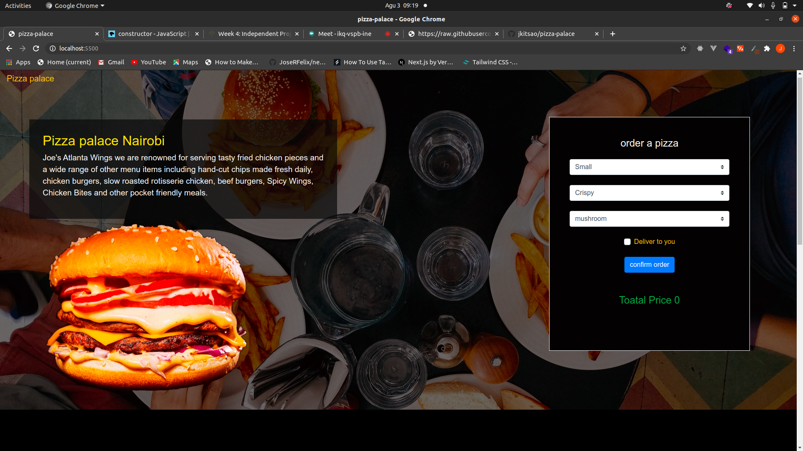

<h1 style='color:green'> Pizza palace</h1>

> Simple webapplication for a fictional restaurant that allows a customer to order different sizes of pizzas with one or more toppings. 




# How it works
* Choose the size of pizza I want e.g Small, Medium, Large
* Choose what kind of crust I would like the pizza to have e.g * Crispy, Stuffed, Gluten-free
* Choose the topping(s) I want on my pizza.
* Place an order for my Pizza and see the total charge for it.

## Installation

```bash
git clone https://github.com/jkitsao/pizza-palace.git

```


## About me

Jackson kitsao – [@Jacksonkitsao](https://twitter.com/Jacksonkitsao5) –kitsaojackson22@gmail.com


[https://github.com/jkitsao/pizza-palace](https://github.com/jkitsao/pizza-palace)

## want to Contributing

1. Fork it (<https://github.com/jkitsao/pizza-palace/fork>)
2. Create your feature branch (`git checkout -b feature/fooBar`)
3. Commit your changes (`git commit -am 'Add some fooBar'`)
4. Push to the branch (`git push origin feature/fooBar`)
5. Create a new Pull Request

